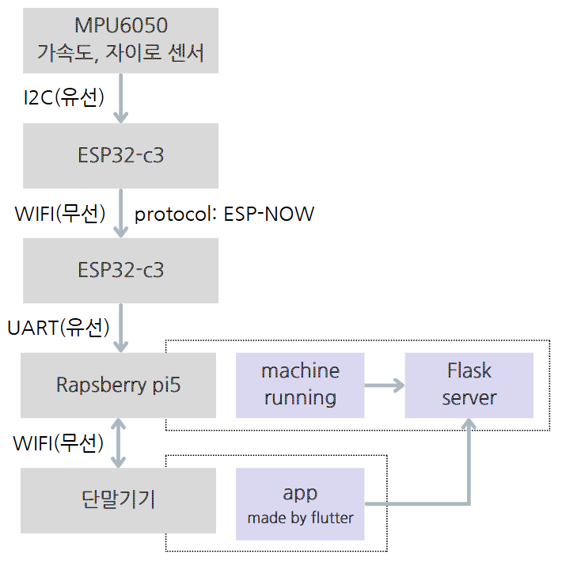

# TIRE (Tire Inspection and Real-time Evaluation)

<div align="center">
  
  
  [](https://opensource.org/licenses/MIT)
  [](https://www.python.org/downloads/)
  [](https://flutter.dev/)
  [](https://www.espressif.com/en/products/socs/esp32-c3)
</div>

## 📋 프로젝트 개요

**TIRE**는 MPU6050 가속도 센서와 ESP32 마이크로컨트롤러를 활용하여 자전거 타이어 공기압을 실시간으로 진단하는 스마트 모니터링 시스템입니다. 머신러닝을 통해 타이어 상태를 분석하고, Flutter 앱을 통해 직관적인 사용자 경험을 제공합니다.

### 🎯 주요 성과
- **96.4%** 정확도의 LSTM 기반 타이어 공기압 분류 모델
- **25,706개** 데이터 포인트를 통한 실증적 검증
- **실시간 모니터링** 시스템 구현
- **저비용 센서** 활용으로 실용성 확보

## 🚀 주요 기능

### 🔬 센서 기반 진단
- MPU6050 6축 가속도/자이로 센서를 통한 정밀 측정
- 35ms 주기의 안정적인 데이터 수집
- FFT 기반 주파수 도메인 분석

### 🤖 머신러닝 분류
- **LSTM**: 96.4% 정확도 (최고 성능)
- **Hybrid CNN-LSTM**: 94.2% 정확도
- **XGBoost**: 87.3% 정확도
- **1D CNN**: 73.2% 정확도

### 📱 실시간 모니터링
- Flutter 기반 크로스플랫폼 모바일 앱
- WebSocket을 통한 실시간 데이터 스트리밍
- 직관적인 타이어 상태 시각화

## 🛠️ 시스템 아키텍처

<div align="center">
  
</div>

### 하드웨어 구성
- **MPU6050**: 3축 가속도 + 3축 자이로스코프
- **ESP32-C3**: 센서 데이터 수집 및 무선 전송
- **Raspberry Pi 4**: 데이터 처리 및 서버 운영

### 소프트웨어 스택
- **데이터 수집**: Arduino IDE (ESP32-C3)
- **데이터 처리**: Python (pandas, numpy, scikit-learn, tensorflow)
- **서버**: Flask + WebSocket
- **모바일 앱**: Flutter (Dart)

## 📊 실험 결과

### 주파수 분석 결과


타이어 공기압 변화에 따른 주파수 스펙트럼 차이를 확인:
- **35 PSI**: 저주파 대역 우세 (타이어 강성 낮음)
- **50 PSI**: 중간 주파수 대역 균등 분포
- **60 PSI**: 고주파 대역 집중 (타이어 강성 높음)

### 머신러닝 모델 성능
<div align="center">
  <table>
    <tr>
      <td align="center">
        <br/>
        <b>LSTM (96.4%)</b>
      </td>
      <td align="center">
        <br/>
        <b>Hybrid (94.2%)</b>
      </td>
    </tr>
    <tr>
      <td align="center">
        <br/>
        <b>XGBoost (87.3%)</b>
      </td>
      <td align="center">
        <br/>
        <b>1D CNN (73.2%)</b>
      </td>
    </tr>
  </table>
</div>

## 🔧 설치 및 설정

### 1. 하드웨어 연결

#### ESP32-C3와 MPU6050 연결
<div align="center">
  
  
</div>

```
MPU6050 → ESP32-C3
VCC     → 3.3V
GND     → GND
SCL     → GPIO05
SDA     → GPIO04
```

### 2. 소프트웨어 설정

#### ESP32-C3 (Arduino IDE)
```bash
# 필요한 라이브러리 설치
- Adafruit MPU6050
- ESP32 by Espressif Systems

# 코드 업로드
- esp32/sender/ → 송신용 ESP32-C3
- esp32/broker/ → 수신용 ESP32-C3
```

#### Raspberry Pi
```bash
# Python 환경 설정
pip install pandas numpy matplotlib seaborn plotly scikit-learn tensorflow joblib websockets

# 서버 실행
cd raspberry_pi/
python server/server.py
```

#### Flutter 앱
```bash
# 의존성 설치
flutter pub get

# 앱 실행
flutter run
```

## 📱 사용 방법

### 1. 시스템 초기화
1. ESP32-C3 전원 켜기
2. Raspberry Pi에서 서버 실행
3. Flutter 앱 실행 및 연결

### 2. 타이어 모니터링
- 실시간 가속도 데이터 확인
- 자동 공기압 분류 결과 표시
- 이력 데이터 및 트렌드 분석

### 3. 진단 결과 해석
- **정상 (50-60 PSI)**: 녹색 표시
- **저압 (35 PSI)**: 노란색 경고
- **이상**: 빨간색 알림

## 📁 프로젝트 구조

```
TIRE/
├── 📁 esp32/                    # ESP32-C3 펌웨어
│   ├── sender/                  # 송신 모듈 코드
│   └── broker/                  # 수신 모듈 코드
├── 📁 raspberry_pi/             # 데이터 처리 서버
│   ├── data_collector/          # UART 데이터 수신
│   └── server/                  # WebSocket 서버
├── 📁 flutter_app/              # 모바일 애플리케이션
├── 📁 analysis/                 # 데이터 분석 코드
├── 📁 mpudata/                  # 수집된 원시 데이터
├── 📁 report/                   # 연구 보고서 (LaTeX)
│   ├── main윤 - 머신러닝 모델 개발
- 조서영 - 모바일 앱 개발

## 📚 참고 문헌

1. **타이어 역학 이론**: "Tire Mechanics and Vehicle Dynamics" - Hans Pacejka
2. **진동 분석**: "Mechanical Vibrations" - Singiresu S. Rao
3. **센서 융합**: "Sensor Fusion: Architectures, Algorithms, and Applications" - IEEE
4. **머신러닝**: "Pattern Recognition and Machine Learning" - Christopher Bishop

## 📄 라이선스

이 프로젝트는 MIT 라이선스 하에 제공됩니다. 자세한 내용은 [LICENSE](LICENSE) 파일을 참조하세요.

## 🤝 기여하기

프로젝트에 기여하고 싶으시다면:
1. 이 저장소를 Fork 해주세요
2. 새로운 기능 브랜치를 생성하세요 (`git checkout -b feature/AmazingFeature`)
3. 변경사항을 커밋하세요 (`git commit -m 'Add some AmazingFeature'`)
4. 브랜치에 Push 하세요 (`git push origin feature/AmazingFeature`)
5. Pull Request를 열어주세요

## 📞 연락처

프로젝트에 대한 문의사항이나 협업 제안은 언제든 환영합니다!

**Email**: rimind@ulsan.ac.kr  
**University**: 울산대학교 전기공학부  
**Location**: 울산광역시, 대한민국

---

<div align="center">
  <p><strong>TIRE</strong> - 더 안전하고 스마트한 자전거 라이딩을 위해 🚴‍♂️</p>
  <p>Made with ❤️ by RiMind Team</p>
</div> 
